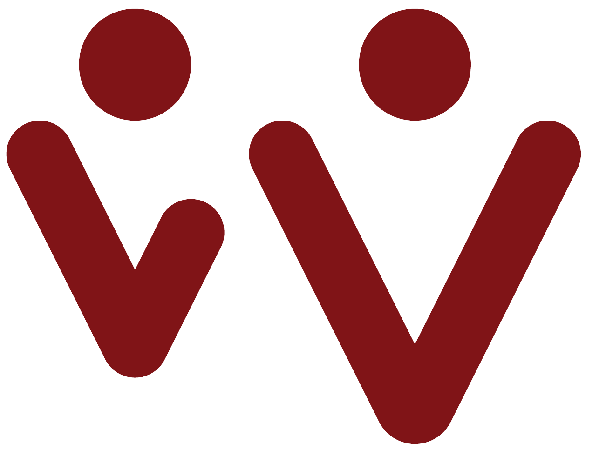

<p align="center">
  
</p>

<h1 align="center">Wintima Foundation</h1>

<p align="center">
  Official website for the Wintima Foundation — education-focused nonprofit work in Ghana.
</p>

<p align="center">
  <a href="https://wintima.org"></a>
</p>

<p align="center">
  <a href="https://github.com/Wintima/wintima-new/actions/workflows/ci.yml"></a>
  
  
  
  
  
  
  
  
</p>

---

**Internal repository** — maintained by the Wintima organization. This project is not open for public contributions.

## Branches & deployment

| Branch | Role | Deployment |
|--------|------|------------|
| `main` | Production | Vercel production |
| `dev` | Integration | Vercel preview |
| `feature/*`, `fix/*`, … | Work in progress | Vercel preview per PR |

See [docs/GIT_WORKFLOW.md](docs/GIT_WORKFLOW.md) and [docs/VERCEL_DEPLOYMENT.md](docs/VERCEL_DEPLOYMENT.md).

## Quality gates

Pull requests to `main` and `dev` must pass **GitHub Actions CI** and review before merge.

| Check | What it covers | Runs |
|-------|----------------|------|
| Lint & Format | ESLint, Prettier | Every PR |
| Type Check | `tsc --noEmit` | Every PR |
| Unit Tests | Vitest | Every PR |
| Security | `npm audit` (high severity+) | Every PR |
| Dependency Review | PR dependency changes | Every PR |
| Build | `next build` | Every PR |
| E2E Tests | Playwright Chromium, production build artifact | Every PR |
| E2E Full Matrix | Chromium, Firefox, WebKit, Mobile Chrome, Mobile Safari | Nightly |
| Release Target Policy | PRs to `main` must come from `dev` only | PRs to `main` |

A **nightly** workflow runs the full Playwright matrix when there are recent commits.

Local hooks (Husky): lint-staged on commit, typecheck on push, conventional commits via commitlint.

## E2E test coverage

| Spec | Routes | Key checks |
|------|--------|------------|
| `e2e/pages/home.spec.ts` | `/` | Hero, timeline, CTAs, responsive, a11y |
| `e2e/pages/about.spec.ts` | `/about` | Focus areas, strategy, founder, a11y |
| `e2e/pages/projects.spec.ts` | `/projects` | Current project, 9-project timeline, donate CTA |
| `e2e/pages/team.spec.ts` | `/team` | 11 members, founder, volunteer CTA |
| `e2e/pages/blog.spec.ts` | `/blog` | Post card, read-more navigation |
| `e2e/pages/gallery.spec.ts` | `/gallery` | Images, lightbox, conditional filters |
| `e2e/pages/donate.spec.ts` | `/donate` | GoFundMe, Mobile Money, copy button |
| `e2e/pages/contact.spec.ts` | `/contact` | Form validation, submission, volunteer preselect |
| `e2e/navigation.spec.ts` | All primary | Header, footer, mobile menu, redirects |
| `e2e/responsive.spec.ts` | All primary | 320px overflow, touch targets, hamburger |
| `e2e/accessibility.spec.ts` | All primary | axe WCAG 2.1 AA, skip link, form labels |
| `e2e/seo.spec.ts` | All primary | title, description, OG, canonical, link crawl |
| `e2e/404.spec.ts` | 404 | Branding, recovery links |

## Development

**Requirements:** Node.js 22.x (see `.nvmrc`)

```bash
npm ci
cp .env.example .env.local   # optional; see variable comments
npm run dev
```

Open [http://localhost:3000](http://localhost:3000).

### Common commands

| Command | Purpose |
|---------|---------|
| `npm run validate` | Lint, format check, typecheck, unit tests |
| `npm run ci:check` | Full CI minus E2E |
| `npm test` | Playwright E2E (Chromium; uses `dev` server locally) |
| `npm run test:e2e` | Same as `npm test` |
| `npm run test:e2e:smoke` | Page + navigation + 404 specs only |
| `npm run test:e2e:seo` | SEO and routing specs |
| `npm run test:e2e:a11y` | Accessibility specs |
| `npm run test:ui` | Playwright UI mode |
| `npm run test:headed` | Playwright headed mode |
| `npm run test:report` | Open HTML test report |
| `npm run build` | Production build |

Local E2E uses `npm run dev`. CI E2E uses a production build (`npm run start`) for parity with deployed output. For the full browser matrix locally: `PLAYWRIGHT_FULL_MATRIX=1 npm test`.

## License & access

Private organizational codebase. For questions about this repository, contact the Wintima Foundation maintainers.
